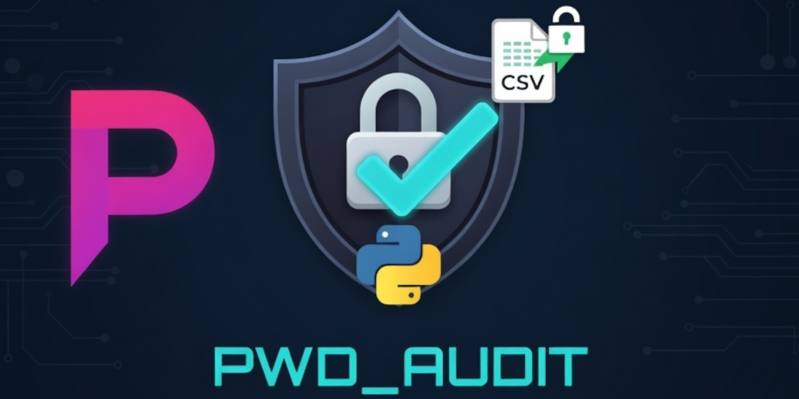
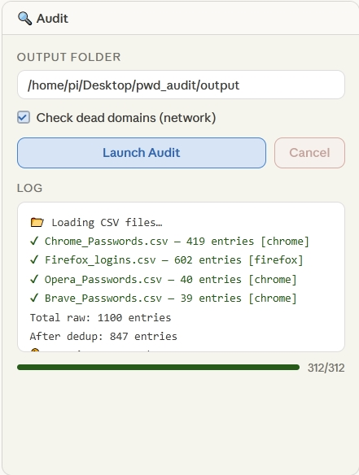
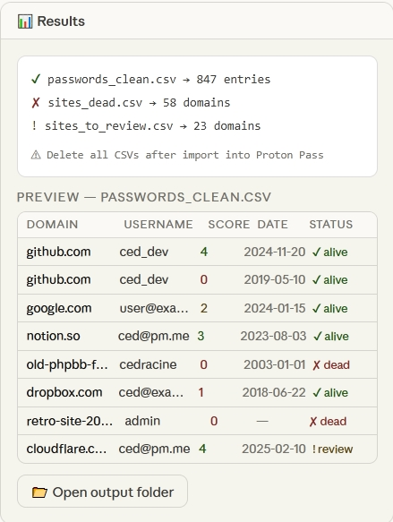

# PWD_AUDIT 🔐



> **Merge, clean and audit all your browser passwords — then import cleanly into Proton Pass.**

A local Python/Tkinter GUI that fuses CSV exports from Chrome, Firefox, Opera, Vivaldi, Safari, Brave and Proton Pass, scores password strength, detects dead domains, and outputs a clean CSV ready to import.

**100% local. No data leaves your machine.**
## Download

[](https://github.com/cedracine/pwd_audit/releases/latest/download/pwd_audit_package.zip)
---

## Features

- 🗂 **Multi-browser merge** — Chrome, Firefox, Opera, Vivaldi, Safari, Brave, Tor Browser, Proton Pass
- 🔑 **Password strength scoring** — zxcvbn (score 0–4 + label)
- 💀 **Dead domain detection** — HEAD requests, threaded (NXDOMAIN, timeout, 403…)
- 🧹 **Exact deduplication** — same domain + user + password + date = one entry
- 📅 **Chronological sort** — domain A→Z, then date DESC (newest first, undated entries on top)
- 📊 **3 output files** — clean passwords, dead sites, sites to review
- 🖥 **Tkinter GUI** — runs on Windows 10, macOS, Linux, Raspberry Pi

---

## Screenshots

| Audit tab | Results tab |
|-----------|-------------|
|  |  |

---

## Requirements

- Python 3.8+
- [`zxcvbn`](https://pypi.org/project/zxcvbn/) — password strength library

```bash
pip install zxcvbn
```

> **Raspberry Pi / Linux:** use `pip3 install zxcvbn --break-system-packages`

Tkinter is included with Python on Windows and most Linux distros.  
On Debian/Raspberry Pi if missing: `sudo apt install python3-tk`

---

## Usage

```bash
python pwd_audit_gui.py        # Windows
python3 pwd_audit_gui.py       # macOS / Linux / Raspberry Pi
```

### Steps

1. **Export CSVs** from each browser (see [Export Guide](#export-guide) below)
2. **Add CSVs** — Tab *📂 Files* → "Add CSV(s)"
3. **Run audit** — Tab *🔍 Audit* → choose output folder → "Launch Audit"
4. **Import** `passwords_clean.csv` into Proton Pass via *Settings → Import → Generic CSV*
5. **Delete all CSVs** from disk after import ⚠️

---

## Output Files

| File | Contents |
|------|----------|
| `passwords_clean.csv` | All entries, sorted, scored — **import this into Proton Pass** |
| `sites_dead.csv` | Domains that didn't respond (NXDOMAIN, timeout…) — safe to delete |
| `sites_to_review.csv` | Ambiguous domains (403, odd redirects) — check manually |

### Column reference — `passwords_clean.csv`

| Column | Description |
|--------|-------------|
| `domain` | Bare domain (no www, no path) |
| `name` | Entry label from browser |
| `url` | Full URL |
| `username` | Username |
| `password` | Password |
| `date` | Date last modified (ISO format) |
| `source` | Source browser (`chrome` / `firefox`) |
| `strength_score` | zxcvbn score 0–4 |
| `strength_label` | Très faible / Faible / Moyen / Fort / Très fort |
| `site_status` | `alive` / `dead` / `review` / `skipped` |
| `site_reason` | HTTP code or error reason |

---

## Export Guide

### Chrome / Edge / Brave / Opera / Vivaldi
```
chrome://password-manager/settings  →  ⋮  →  Export passwords
```
CSV format: `name, url, username, password`

### Firefox / Tor Browser
```
about:logins  →  ⋯  →  Export logins
```
CSV format: `url, username, password, guid, timeCreated, timePasswordChanged`

### Safari (macOS only)
```
Safari menu  →  Settings  →  Passwords  →  ···  →  Export All Passwords
```
CSV format: `Title, URL, Username, Password, OTPAuth, Notes`

> ⚠️ Disable iCloud Drive / Time Machine before exporting to avoid unencrypted cloud backup.

### Proton Pass (existing export)
```
Extension  →  ☰  →  Settings  →  Export  →  CSV
```
CSV format: `name, url, email, username, password, note, totp, vault`

---

## Proton Pass Import

Proton Pass *Generic CSV* accepts 8 fields:

```
name, url, username, password, email, note, totp, vault
```

In the extension: **☰ → Settings → Import → Generic CSV** → select `passwords_clean.csv`

---

## Supported Platforms

| Platform | Status |
|----------|--------|
| Windows 10 / 11 | ✅ Tested |
| macOS | ✅ Supported |
| Linux | ✅ Supported |
| Raspberry Pi (TwisterOS / Raspberry Pi OS) | ✅ Tested |

---

## Security Notes

- All processing is **local** — no passwords are sent over the network
- Domain checks send only the **domain name** (no credentials) via HEAD requests
- Delete all CSV files from disk after completing your import
- Consider running the tool on an air-gapped machine for maximum OpSec

---

## License

MIT — see [LICENSE](LICENSE)

---

## Acknowledgements

- [zxcvbn](https://github.com/dwolfhub/zxcvbn-python) — password strength estimator
- [Proton Pass](https://proton.me/pass) — the password manager this tool targets
